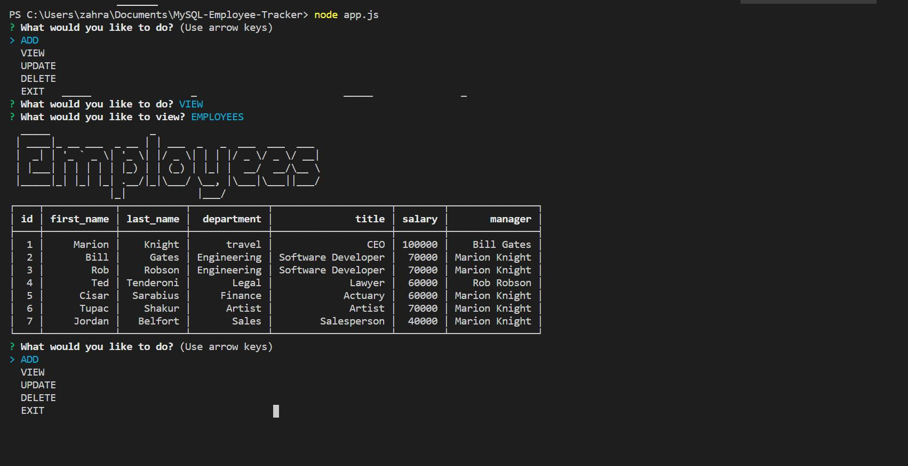

# MySQL: Employee-Tracker

## Description 

Developers are often tasked with creating interfaces that make it easy for non-developers to view and interact with information stored in databases. Often these interfaces are known as Content Management Systems. In this homework assignment, your challenge is to architect and build a solution for managing a company's employees using node, inquirer, and MySQL.

## Installation
Run:

                npm i

## Usage

This command-line application allows the user to:

  * Add departments, roles, employees

  * View departments, roles, employees

  * Update employee roles

  * Update employee managers

  * Delete departments, roles, and employees

The application will be invoked with the following command:

                node app.js
                
### App working demo

 
[Video Link App Working](https://youtu.be/Cq3yDpSIoy0)
